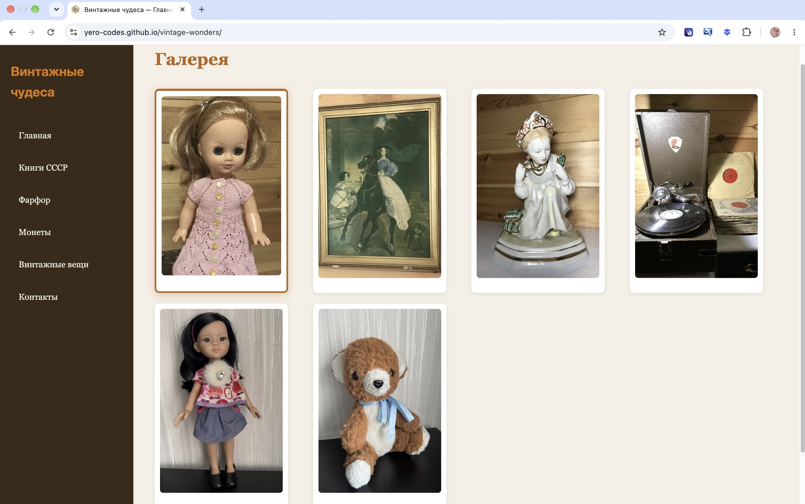
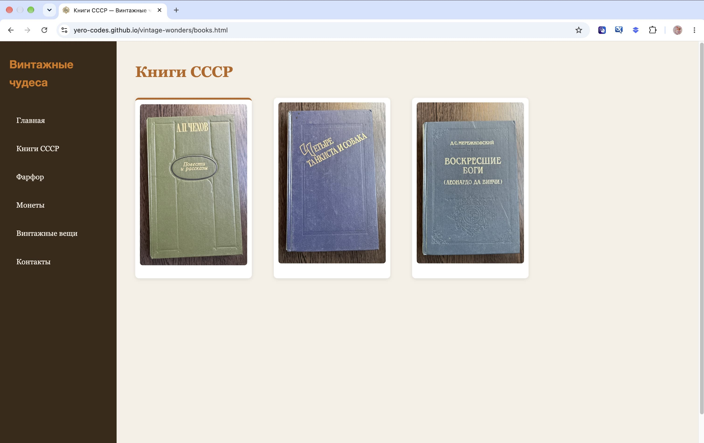
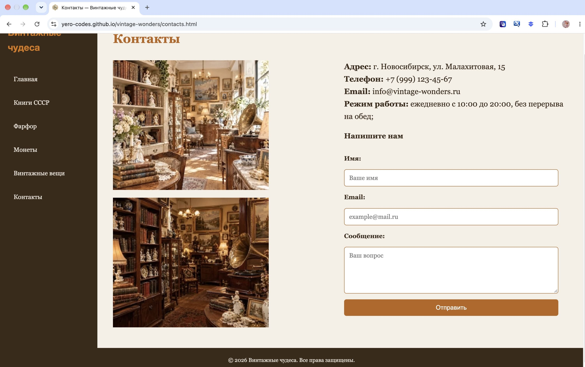

# Винтажные чудеса

Галерея винтажных вещей: книги СССР, фарфор, монеты, картины, патефоны.

## Живой сайт

[yero-codes.github.io/vintage-wonders](https://yero-codes.github.io/vintage-wonders/)

## Скриншоты





## О проекте

Многостраничный сайт-галерея с меню, адаптивом, формами и анимациями. Мой первый учебный проект по фронтенд-разработке.

## Страницы

- `index.html` — главная, галерея
- `books.html` — книги СССР
- `farfor.html` — фарфор
- `money.html` — монеты и банкноты
- `vintagethings.html` — винтажные вещи
- `contacts.html` — контакты и форма

## Технологии

- HTML5
- CSS3 (Flexbox, Grid, медиа-запросы, `@keyframes`)
- JavaScript (кнопка «Наверх»)
- Адаптив: телефон, планшет, компьютер
- Форма: Formspree
- Хостинг: GitHub Pages

## Что освоено

- Смысловые теги, `figure`, `figcaption`
- Многостраничный сайт
- Flexbox и Grid, `grid-template-areas`
- Позиционирование: `sticky`, `fixed`, `absolute`
- Анимации `@keyframes`
- Адаптив для трёх диапазонов
- JavaScript: `querySelector`, `addEventListener`, `scrollTo`
- Оптимизация картинок
- Lighthouse: 100/100/100/91
- Git и GitHub

## Структура
   ```
vintage-wonders/
├── index.html
├── books.html
├── farfor.html
├── money.html
├── vintagethings.html
├── contacts.html
├── style.css
├── script.js
├── favicon.png
├── apple-touch-icon.png
└── images/
   ```

## Запуск локально

1. Склонируйте репозиторий:
   ```
   git clone https://github.com/yero-codes/vintage-wonders.git
   ```

2. Откройте `index.html` в браузере.